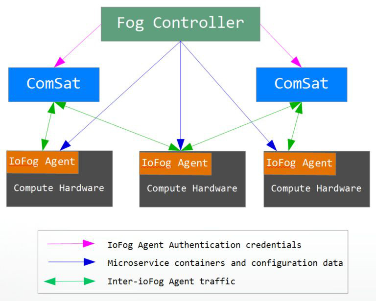

# iofog-demo

Setting up a cluster with [iofog](https://iofog.org/), based on the [quick start guide](https://iofog.org/docs/1.3.0/getting-started/quick-start.html)

Iofog system runs as a Fog Controller and a set of IoFogAgents on each of the devices.



The ComnSat or Connector helps to stablish teh network between the controller and the nodes that run that agents.

The next steps will setup the IoFog running on a local device in Docker compose. It is also possible to run the [IoFog Controller on Kubernetes](https://edgeworx.io/kubernetes) by installer it using the [helm charts](https://github.com/eclipse-iofog/helm)


## Build iofogctl

You can use the packaged version, which did nto work in my case

```bash
curl https://packagecloud.io/install/repositories/iofog/iofogctl/script.deb.sh | sudo bash
sudo apt-get install iofogctl=1.3.0-beta
```

Instead you can also build iofogctl from the source code. since iofogctl still depends on 'dep', you will need to [install it](https://golang.github.io/dep/docs/installation.html)

The you can checkout iofogctl repo and build it.

```shell
git clone git@github.com:eclipse-iofog/iofogctl.git
cd iofogctl
make all
```

You can the check ioforctl is running the _iofogctl version_ command

```
iofogctl version
iofogctl Unified Cli

Copyright (C) 2019, Edgeworx, Inc.

version: 0.0.0-dev
platform: linux/amd64
commit: c74b764a7876127829489167d008eea3c4443a92
date: 2019-10-15T13:09:23-0600
```

## Install iofog Control Plane om Docker

Edit the build/iofog/quick-start.yaml to configure a password you want to use

```shell
iofogctl deploy -f build/iofog/quick-start.yaml
```


## Install a sample application

The next step is to deploy a sample application into the control plane, that is just managing a single localhost node.


```shell
iofogctl deploy -f heart-rate-app.yaml
```


Check the status of the application, untill both micro services are running.

```shell
iofogctl get microservices
```

```
MICROSERVICE		STATUS		AGENT		CONFIG							ROUTES			VOLUMES		PORTS
heart-rate-monitor	RUNNING		local-agent	{"data_label":"Anonymous Person","test_mode":true}	heart-rate-viewer
heart-rate-viewer	RUNNING		local-agent	{}										/tmp/msvc:/tmp	5000:80
```

### Check the application

Access the UI opning the link [http://horus.local:5000/](http://horus.local:5000/)

### Tear down

```
iofogctl delete all
```

## Install ioFog on  Raspberry PI

In this step we will configure a RPI3 devicde to run as a node connected to the control plane, following [this guide](https://iofog.org/docs/1.3.0/remote-deployment/prepare-your-remote-hosts.html)

## Setup the RPI devices

### Setup Raspian

Change pi user passwd
Enable Wifi
Enable SSH
Change Host Name

```shell
raspi-config
```

Add user and set it up as a sudoer

```
usermod -aG sudo $USER
```

### Add your key in to the RPI device

```shell
ssh-copy-id galo@derr.local
```

### Pre

## Kubernetes

This section go over teh steps to setup ioFog contro lpane on a Kubernetes cluster.

### Install iofog Control Plane on Kubernetes using Minikube

This will setup iofog in a [minikube](https://kubernetes.io/docs/tasks/tools/install-minikube/) local enviroment.

```shell
iofogctl deploy controlplane -f build/iofog/controlplane.yaml
```

### Deploy Controllers on Remote Hosts

Make sure you Raspberry is connected and working, the controller willl try top connect to the address _luxor.local_ using the credentials described above

The controller will SSH into the RaspberryPi using SSH, therefore you need to setup crendetials on teh RPI device


```shell
ssh-copy-id luxor.local
```
Ass the user into teh sudoer list on teh RPI

```shell
ssh luxor.local
sudo usermod -aG sudo $USER
```


```shell
iofogctl deploy controlplane -f build/iofog/remote_controller.yaml
```

## Helm Install

### Install iofog Control Plane on Kubernetes using microk8s

In this step we will setup ifogctl on kubernetes, you can use minikube, or microk8s. In this scenario I will use microk8s.

### Enable helm

```shell
microk8s.enable helm
```

### Install ioFog Stack

Add this repository to your Helm repository index and install the ioFog stack and Kubernetes services

microk8s.helm init --service-account tiller


```shell
microk8s.helm repo add iofog https://eclipse-iofog.github.io/helm
microk8s.helm install --name iofog --namespace iofog iofog/iofog
```

### Install iofog Control Plane on Kubernetes using minikube and Helm


#### Create Service Account for Tiller

Note that on RBAC enabled Kubernetes clusters (e.g. GKE, AKE) it is necessary to create a service account for Tiller before initializing helm. See helm init instructions for more details.

```shell
kubectl create -f build/eks/helm-service-account.yaml
helm init --service-account tiller
```

#### Install ioFog Stack with Helm

Add this repository to your Helm repository index and install the ioFog stack and Kubernetes services

```shell
helm repo add iofog https://eclipse-iofog.github.io/helm
helm install --name iofog --namespace iofog iofog/iofog
```

## References

1. [ioFog](https://iofog.org/docs/1.3.0/tutorial/get-to-know-iofog.html)